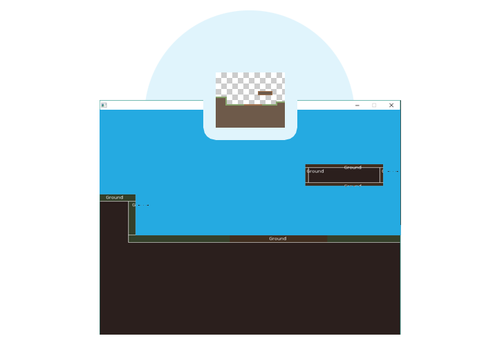

A tile LÖVE map loader from pixel information of an image.

## Example

```lua
local pixelmap = require('pixelmap')

pixelmap.register(0) -- Default tile
pixelmap.register(1, "#86a36bff", { "Ground" })
pixelmap.register(2, "#a47550ff", { "Ground" })
pixelmap.register(3, "#6e5a4aff")

local map = pixelmap.load('map.png')

--[[
{
	tiles= {
		{0,0,0,0,0,0}
		{0,0,1,1,0,3}
		{0,0,2,2,0,3}
	},
	groups = {
		"Ground" = { { x=3,y=2,w=2,h=2} }
	}
}]]

```

See the complete sample : [./sample](./sample)

## Installation

Just copy the `pixelmap.lua` file somewhere in your projects (maybe inside a `/lib/` folder) and require it accordingly.

## API

### Property `pixelmap.isCache = true`

Indicates whether the loaded map should be saved as lua table in the folder `.pixelmap/<path_img>.lua` of the local storage for quicker next load.

### Function `pixelmap.register(color,tile,groups)`

Registers a tile and associate it to a pixel color. Groups can be added to generate area of tiles from same groups (collisions for example)

* *arg* `tile` - `object` - `required` : the value of the tile (could be its id, irs coords, ...). The structure must really simple in order to be serialized.
* *arg* `color` - `string` - `optional` : the RGBA hexadecimal color of the pixel color (ex: `"#ff2200ff"`). If not precised, its the default tile.
* *arg* `groups` - `array<string>` - `optional` : the group ids of the tile.


### Function `pixelmap.load(path) : Map`

Loads an image, reads each of its pixels and generate a map table containing the tiles and groups.

* *arg* `path` - `string` - `required` : path the image containing the pixels of the map.
* *returns* A `Map` table

### Type `Map`

The result of the loading process.

*Example* : 

```lua
{
	tiles= {
		[2] = { [3]="G", [4]="C", [5]="C" },
		[4] = { [1]="O" }
	},
	groups = {
		"Ground" = { { x=2,y=3,w=1,h=3} }
	}
}
```

## Roadmap / Ideas

* Add layer supports from file naming convention.

## Copyright and license

MIT © [Aloïs Deniel](http://aloisdeniel.github.io)
